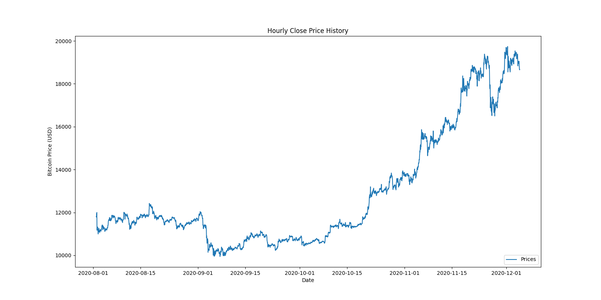
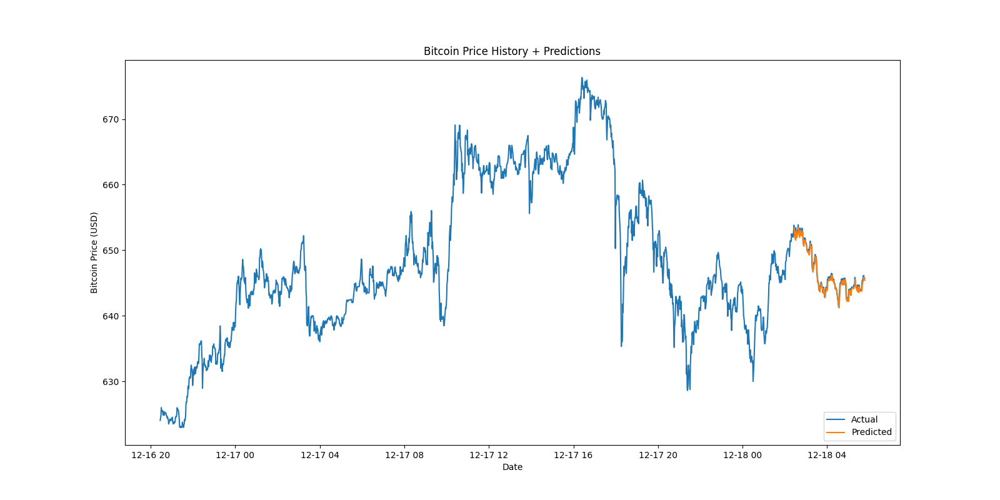
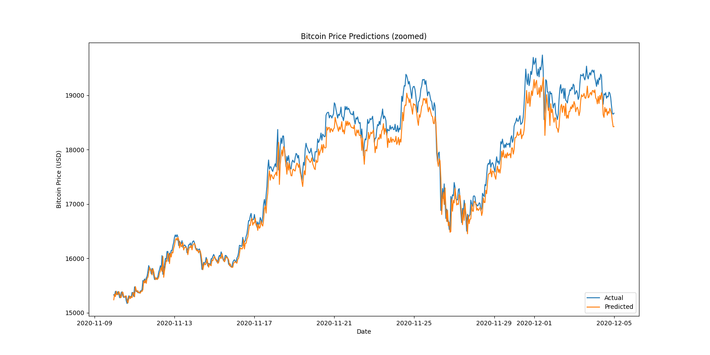
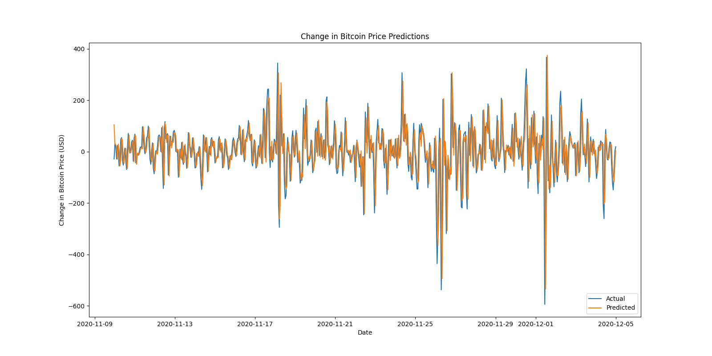
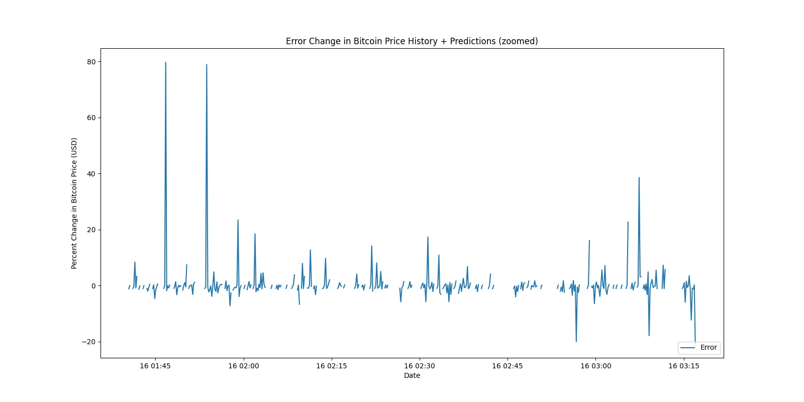

# pycoin

PyCoin is an automated cryptocurrency trading application. Right now it is just a pet project, but will hopefully become more than that soon. It consists of two parts – intermarket arbitrage, and intramarket arbitrage. Both are very much a work in progress.

## Intramarket

An automated speed trading algorithm for cryprocurrency using LSTM. Cryptocurrency was chosen over the stock market due to the limits on trading frequency with less than $25K in your portfolio. The goal of this algorithm is to predict with a >51% gain or loss on bitcoin within the second and then make a trade based on that data.

### Trading Logic

The trading logic used for this is based on the derivative of the predictions graph. Currently the algorithm is able to correctly predict whether the crypto price is increasing or decreasing no less than 80% of the time. I have found the model to perform best with the lookback set to `1`, epochs between `10` and `15`, and units around `256`. I also found that the size of the rolling dataset works best between `1800` to `2400` datapoints. According to graph error, it looks as though the model needs to be retrained every half an hour to an hour at minimum. As far as structure goes – the main class will be `CryptoTrader`. It will incorporate `CrytoPredictor` and `KrakenTrader` and bring them together in one class for a fully functioned release.

```
$ python3 CryptoTrader.py

lookback = 1 
epochs = 13 
units = 256 
batch_size = 1

Epoch 1/13
2399/2399 - 7s - loss: 0.0023
Epoch 2/13
2399/2399 - 6s - loss: 3.3973e-04
Epoch 3/13
2399/2399 - 6s - loss: 3.3747e-04
Epoch 4/13
2399/2399 - 7s - loss: 2.8918e-04
Epoch 5/13
2399/2399 - 6s - loss: 2.6515e-04
Epoch 6/13
2399/2399 - 6s - loss: 2.6624e-04
Epoch 7/13
2399/2399 - 6s - loss: 2.4568e-04
Epoch 8/13
2399/2399 - 6s - loss: 2.4556e-04
Epoch 9/13
2399/2399 - 6s - loss: 2.2387e-04
Epoch 10/13
2399/2399 - 6s - loss: 2.1883e-04
Epoch 11/13
2399/2399 - 6s - loss: 2.2082e-04
Epoch 12/13
2399/2399 - 6s - loss: 2.3302e-04
Epoch 13/13
2399/2399 - 6s - loss: 2.0773e-04
Saved model to disk

------------------------------
@ 12/20/2020 00:44:33
------------------------------
n-1: $23510.20 (actual)
n: $23517.30 (actual)

n-1: $23503.57 (predicted)
n: $23508.87 (predicted)
n+1: $23508.87 (predicted)

actual (previous) d/dx: 0.71

predicted (previous) d/dx: 0.53
predicted (next) d/dx: 0.00

predicted action: sell
------------------------------ 
```

### Charts
Note that these are just samples from my tests and may not be the direct result of the ouptput immediately above.<br>
Historical hourly Bitcoin prices –

Historical prices + predicted with actual prices –

Historical prices + predicted with actual prices (zoomed in) –

Rate of change of predicted prices –

Perent error in rate of change of predicted prices –


## Intermarket

This side of pycoin will scan given markets for each's crypto price, make a decision on the greatest difference between the two, buy at the lowest, and sell at the highest – all with in the same moment.

Example call for prices: 
```
Asking for BTC on binanceusa...
Asking for BTC on bittrex...
Asking for BTC on kraken...
Asking for BTC on bitfinex...
Asking for BTC on bitstamp...
Asking for BTC on gemini...
At 2020-12-11 10:19:47.768476
{
  "binanceusa": 18058.85,
  "bittrex": 18073.28,
  "kraken": 18070.1,
  "bitfinex": 18087.0,
  "bitstamp": 18070.29,
  "gemini": 18074.83
}
Lowest = binanceusa at $18058.85
Highest = bitfinex at $18087.0
Gross difference => $28.15

Testing ROI per transaction
-----------------------------
Net ROI w/ $10 invested => $0.0255
Net ROI w/ $20 invested => $0.0511
Net ROI w/ $30 invested => $0.0766
Net ROI w/ $40 invested => $0.1021
Net ROI w/ $50 invested => $0.1276
Net ROI w/ $60 invested => $0.1532
Net ROI w/ $70 invested => $0.1787
Net ROI w/ $80 invested => $0.2042
Net ROI w/ $90 invested => $0.2298
Net ROI w/ $100 invested => $0.2553
...Net ROI w/ $500 invested => $1.2764
...Net ROI w/ $1000 invested => $2.5528
...Net ROI w/ $3000 invested => $7.6585
...Net ROI w/ $9000 invested => $22.9754
```

Keep in mind this is meant to be traded up to every 10 seconds, so these values compounded == $$$. Or, at least $.