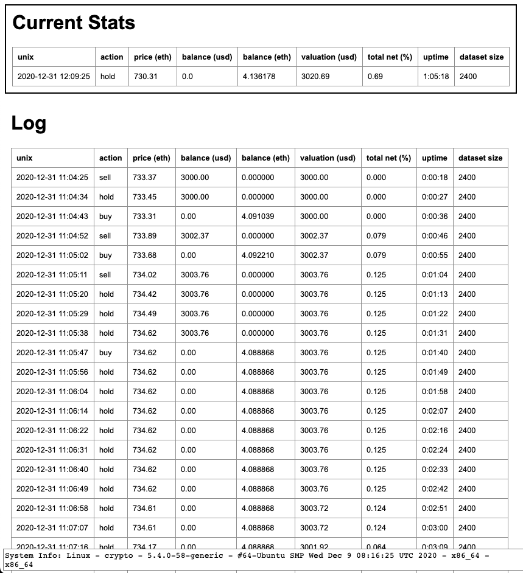

# pycoin

PyCoin is an automated cryptocurrency trading application. Right now it is just a pet project, but will hopefully become more than that soon. It consists of two parts – intermarket arbitrage, and intramarket arbitrage. Both are very much a work in progress.

## Intramarket

An automated speed trading algorithm for cryprocurrency using LSTM. Cryptocurrency was chosen over the stock market due to the limits on trading frequency with less than $25K in your portfolio. The goal of this algorithm is to predict a gain or loss on bitcoin within the next second and then make a trade based on that data.

### Trading Logic

The trading logic used for this is based on the derivative of the predictions graph. Currently the algorithm is able to correctly predict whether the crypto price is increasing or decreasing no less than 80% of the time. I have found the model to perform best with the lookback set to `1`, epochs between `10` and `15`, and units around `256`. I also found that the size of the rolling dataset works best between `1800` to `2400` datapoints. According to graph error, it looks as though the model needs to be retrained every half an hour to an hour at minimum. As far as structure goes – the main class is `CryptoTrader`. It incorporates `CrytoPredictor` and `KrakenTrader` and brings them together in one class. This is then referenced by `app.py` and put together with the web server for a fully functioned release. All current data can be viewed on the webserver at `http://localhost:5000`.

Endpoint: `app.py`

### Installation and Build

First install Docker, Git, and Python.

```
$ python3 -m venv container  # create virtual environment
$ source container/bin/activate  # activate venv
$ ./install  # install dependencies to venv
-- make changes --
$ ./build [x.x.x]  # build and push to remote
$ docker run  -p 5000:5000 ckinateder/pycoin:[x.x.x]  # run container
```

### Sample Console



### Sample Output
```
$ python3 app.py ltc usd 600

--------------------------------------------------------------------------------
@ 12/29/2020 18:53:55
--------------------------------------------------------------------------------
n-1: $129.3600 (actual)
n: $129.2700 (actual)

n-1: $129.1327 (predicted)
n: $129.0323 (predicted)
n+1: $129.1236 (predicted)

actual (previous) d/dx: -0.0090

predicted (previous) d/dx: -0.0100
predicted (next) d/dx: 0.0091

predicted action: buy
-------------------------------------------------------------------------------- 

+ Balance:
  + 0.00 USD
  + 4.73753803 LTC
   (bought)
+ Total net: 2.070%

* Using 460.36 MB of memory
Saved model to disk
Model trained and saved in 105.28s
Last model trained at 2020-12-29 18:52:16.116808-05:00

+ Recieved response with ['Ticker', 'pair=xltczusd']
+ Saved response at time 2020-12-29 18:54:06.126143-05:00 to file data/ltc-usd_kraken.csv

Dataset loaded into frame in 0.01s
Loaded model from disk

--------------------------------------------------------------------------------
@ 12/29/2020 18:54:07
--------------------------------------------------------------------------------
n-1: $129.2700 (actual)
n: $129.2700 (actual)

n-1: $129.3077 (predicted)
n: $129.4065 (predicted)
n+1: $129.3176 (predicted)

actual (previous) d/dx: 0.0000

predicted (previous) d/dx: 0.0099
predicted (next) d/dx: -0.0089

predicted action: hold
-------------------------------------------------------------------------------- 

+ Balance:
  + 0.00 USD
  + 4.73753803 LTC (valued at 612.42 USD)
   (holding)
+ Total net: 2.070%

* Using 464.12 MB of memory

Last model trained at 2020-12-29 18:52:16.116808-05:00
```

### Charts
Note that these are just samples from my tests and may not be the direct result of the ouptput immediately above.<br>
Historical hourly Bitcoin prices –

Historical prices + predicted with actual prices –

Historical prices + predicted with actual prices (zoomed in) –

Rate of change of predicted prices –

Perent error in rate of change of predicted prices –


<!-- 
## Intermarket

This side of pycoin will scan given markets for each's crypto price, make a decision on the greatest difference between the two, buy at the lowest, and sell at the highest – all with in the same moment.

Example call for prices: 
```
Asking for BTC on binanceusa...
Asking for BTC on bittrex...
Asking for BTC on kraken...
Asking for BTC on bitfinex...
Asking for BTC on bitstamp...
Asking for BTC on gemini...
At 2020-12-11 10:19:47.768476
{
  "binanceusa": 18058.85,
  "bittrex": 18073.28,
  "kraken": 18070.1,
  "bitfinex": 18087.0,
  "bitstamp": 18070.29,
  "gemini": 18074.83
}
Lowest = binanceusa at $18058.85
Highest = bitfinex at $18087.0
Gross difference => $28.15

Testing ROI per transaction
-----------------------------
Net ROI w/ $10 invested => $0.0255
Net ROI w/ $20 invested => $0.0511
Net ROI w/ $30 invested => $0.0766
Net ROI w/ $40 invested => $0.1021
Net ROI w/ $50 invested => $0.1276
Net ROI w/ $60 invested => $0.1532
Net ROI w/ $70 invested => $0.1787
Net ROI w/ $80 invested => $0.2042
Net ROI w/ $90 invested => $0.2298
Net ROI w/ $100 invested => $0.2553
...Net ROI w/ $500 invested => $1.2764
...Net ROI w/ $1000 invested => $2.5528
...Net ROI w/ $3000 invested => $7.6585
...Net ROI w/ $9000 invested => $22.9754
```

Keep in mind this is meant to be traded up to every 10 seconds, so these values compounded == $$$. Or, at least $.
-->