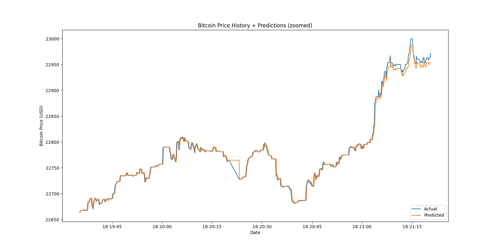

# pycoin

PyCoin is an automated cryptocurrency trading application. Right now it is just a pet project, but will hopefully become more than that soon. It consists of two parts – intermarket arbitrage, and intramarket arbitrage. Both are very much a work in progress.

## Intermarket

This side of pycoin will scan given markets for each's crypto price, make a decision on the greatest difference between the two, buy at the lowest, and sell at the highest – all with in the same moment.

Example call for prices: 
```
Asking for BTC on binanceusa...
Asking for BTC on bittrex...
Asking for BTC on kraken...
Asking for BTC on bitfinex...
Asking for BTC on bitstamp...
Asking for BTC on gemini...
At 2020-12-10 22:16:01.938524
{
  "binanceusa": 17892.1,
  "bittrex": 17920.99,
  "kraken": 17893.5,
  "bitfinex": 17906,
  "bitstamp": 17894.92,
  "gemini": 18265.92
}
```

## Intramarket

An automated speed trading algorithm for cryprocurrency using LSTM. Cryptocurrency was chosen over the stock market due to the limits on trading frequency with less than $25K in your portfolio. The goal of this algorithm is to predict with >51% a gain or loss on bitcoin within the second and then make a trade based on that data.

### Charts
Historical hourly Bitcoin prices –

Historical prices + predicted with actual prices –

Historical prices + predicted with actual prices (zoomed in) –

Rate of change of predicted prices –

